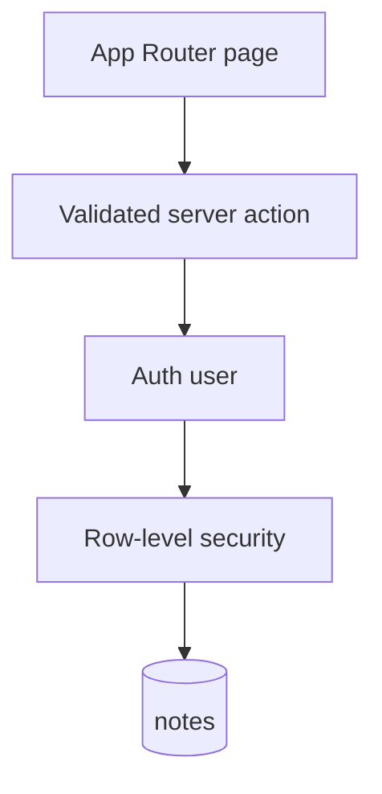

# Architecture

```mermaid
flowchart TD
  Page[App Router page] --> Action[Validated server action]
  Action --> Auth[Auth user]
  Auth --> RLS[Row-level security]
  RLS --> DB[(notes)]
```

The browser uses the publishable key only. Authorization is enforced again by RLS at the database boundary.
